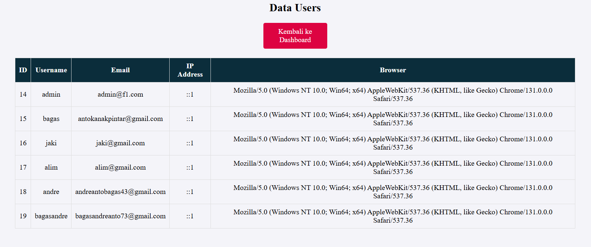
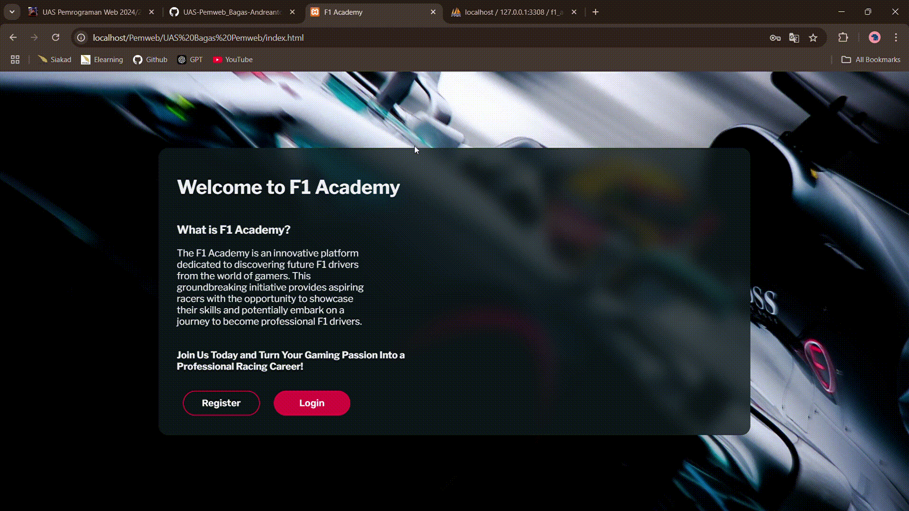
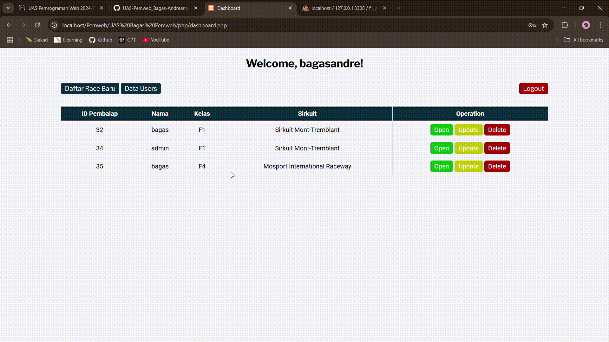
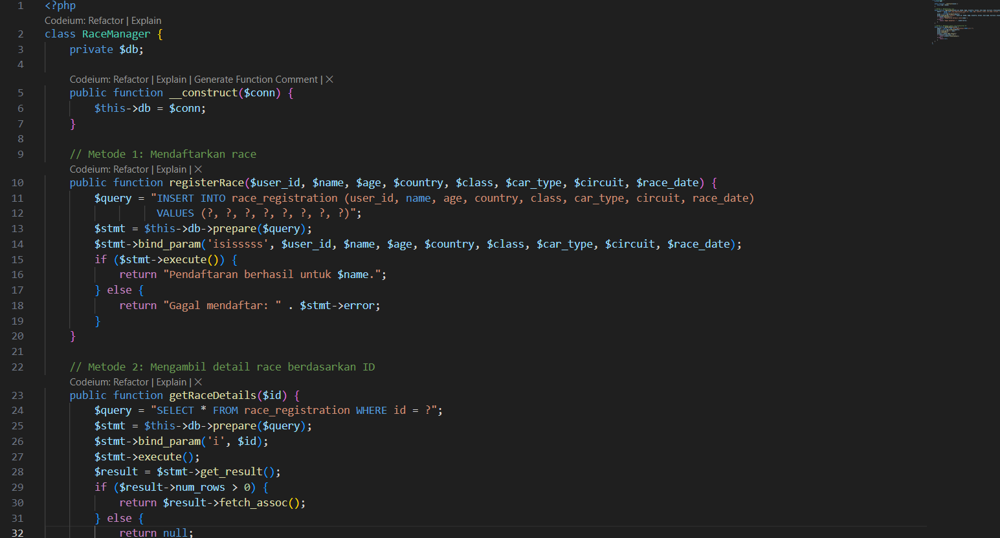
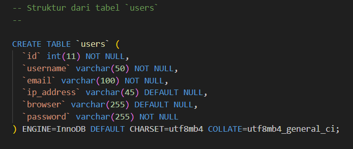
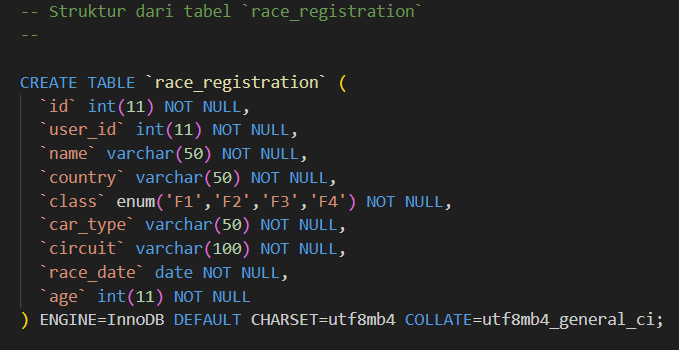
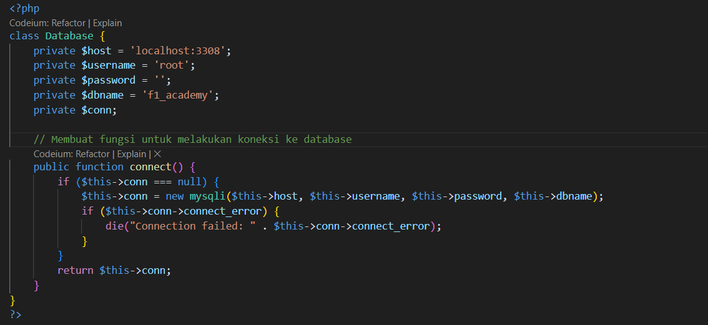
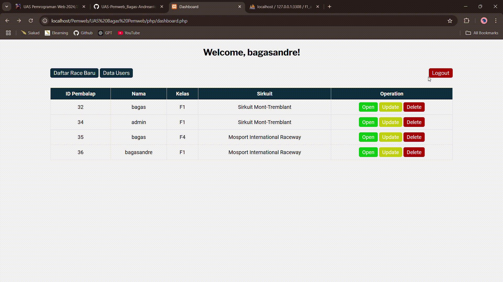
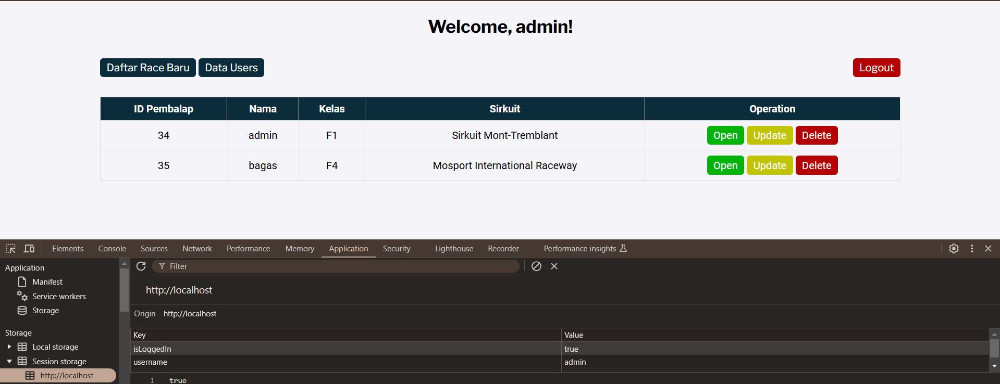
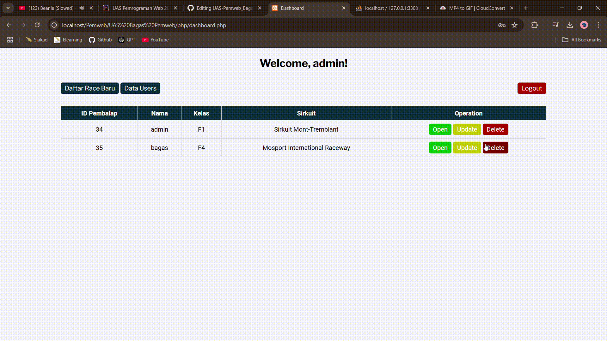

# UAS-Pemweb_Bagas-Andreanto_122140017
# F1 Academy Website

## Data Diri
- Nama: Bagas Andreanto
- NIM: 122140017
- Kelas: Pemrograman Web RA

## Deskripsi Proyek
Platform website ini dirancang untuk mendukung proses registrasi balapan dari akademi F1 yang merupakan lanjutan dari projek UTS. Pada web ini terdapat dua jenis user yaitu Pembalap, dan Admin. User dapat melakukan register dengan meninputkan username, email, dan password, kemudian login untuk dapat mengakses website. 
Pada halaman dashboard, user dapat menambahkan data pendaftaran (Create), membuka data (Read), memperbarui data (Update), dan menghapus data (Delete).

### Perbedaan hak akses untuk user:
Pembalap:
- hanya dapat melihat data user lain, tidak dapat menerapkan operasi update dan delete.
- tidak bisa mengakses data pengguna

Admin:
- bisa melakukan operasi CRUD pada semua data pengguna
- dapat mengakses informasi data pengguna (melihat alamat ip dan jenis browser pengguna)

### Akun Admin
- username: admin
- email: admin@f1.com
- password: admin123

---

## Struktur Proyek

### 1. Client-side Programming (Bobot: 30%)
#### 1.1 Manipulasi DOM dengan JavaScript (15%)
- **Form Input**:
  - Form registrasi dan login memiliki elemen input seperti:
    - Username
    - Email
    - Password
    - Konfirmasi Password

- **Tabel HTML**:
  - Data pendaftaran ditampilkan dalam tabel di halaman `users.php` menggunakan kombinasi PHP dan HTML.

#### 1.2 Event Handling (15%)
- **Event Handling:**
  - `input`: Validasi panjang password di `register.js` dan `login.js`.
  - `blur`: Validasi format email di `login.js`.
  - `submit`: Validasi form sebelum data dikirim ke server.
  - `click`: Menampilkan atau menyembunyikan form menggunakan `main.js`.
- **Validasi Input:**
  - Password minimal 8 karakter.
  - Format email harus valid.
  - Password dan konfirmasi password harus cocok.

   
  
---

### 2. Server-side Programming (Bobot: 30%)
#### 2.1 Pengelolaan Data dengan PHP (20%)
- **Metode POST/GET:**
  - Data dikirim ke server menggunakan metode POST di `register.php` dan `login.php`.
- **Validasi Sisi Server:**
  - Data divalidasi sebelum disimpan ke database.
- **Penyimpanan Data:**
  - Data pengguna, IP address, dan jenis browser disimpan di database pada proses registrasi.
 
   

#### 2.2 Objek PHP Berbasis OOP (10%)
- **Class RaceManager:**
  - `registerRace`: Mendaftarkan pengguna ke race.
  - `getRaceDetails`: Mengambil detail race berdasarkan ID.
- **Penggunaan Objek:**
  - Objek digunakan di `registerace.php` dan `read.php` untuk menangani data race.

  

---

### 3. Database Management (Bobot: 20%)
#### 3.1 Pembuatan Tabel Database (5%)
- Tabel `users` dan `race_registration` dibuat untuk menyimpan data.

  
  
  

#### 3.2 Konfigurasi Koneksi Database (5%)
- `config.php` digunakan untuk koneksi ke database.

  

#### 3.3 Manipulasi Data pada Database (10%)
- **CRUD Operations:**
  - Tambah data pengguna di `register.php`.
  - Tampilkan data di `dashboard.php`.
  - Ubah data race di `update.php`.
  - Hapus data race di `delete.php`.

   

---

### 4. State Management (Bobot: 20%)
#### 4.1 State Management dengan Session (10%)
- **Session:**
  - Sesi dimulai dengan `session_start()`.
  - Informasi pengguna seperti `user_id`, `username`, dan token disimpan dalam session.

  

#### 4.2 Pengelolaan State dengan Cookie dan Browser Storage (10%)
- **Cookie:**
  - Token pengguna disimpan di cookie saat login dan dihapus saat logout.

  
  
- **Browser Storage:**
  - LocalStorage digunakan di `registerace.php` untuk menyimpan data form secara lokal.

---

## File dan Fungsinya

| File            | Fungsi                                                   |
|-----------------|---------------------------------------------------------|
| `config.php`    | Mengatur koneksi ke database.                           |
| `dashboard.php` | Menampilkan data pendaftaran dan navigasi.              |
| `register.php`  | Menangani registrasi pengguna baru.                     |
| `login.php`     | Proses login pengguna.                                  |
| `logout.php`    | Menghapus sesi dan cookie pengguna.                     |
| `read.php`      | Menampilkan detail data race.                           |
| `update.php`    | Mengubah data pendaftaran race.                         |
| `delete.php`    | Menghapus data pendaftaran race.                        |
| `race_manager.php` | Class PHP untuk pengelolaan data race.               |
| `main.js`       | Mengatur interaksi form login dan registrasi.           |
| `login.js`      | Validasi form login.                                    |
| `register.js`   | Validasi form registrasi.                               |

---

## Jawaban Pertanyaan Bonus

### 1. Langkah-langkah Meng-host Aplikasi Web (5%)
1. Memilih penyedia hosting web (contoh: Heroku, Vercel, atau cPanel hosting).
2. Konfigurasi file aplikasi agar kompatibel dengan hosting.
3. Unggah kode aplikasi melalui FTP, Git, atau antarmuka penyedia hosting.
4. Mengatur konfigurasi database pada server (import file SQL).
5. Verifikasi aplikasi berjalan dengan baik di hosting.

### 2. Penyedia Hosting yang Dipilih (5%)
Penyedia hosting yang dipilih adalah **Heroku** karena mendukung aplikasi berbasis PHP dan memiliki integrasi mudah dengan Git untuk deployment otomatis.

### 3. Keamanan Aplikasi Web (5%)
- **Validasi Input:** Semua data yang diterima dari pengguna divalidasi sebelum diproses.
- **HTTPS:** Gunakan protokol HTTPS untuk komunikasi aman.
- **Hashing Password:** Password pengguna di-hash menggunakan algoritma seperti bcrypt sebelum disimpan.
- **Firewall:** Konfigurasi firewall untuk melindungi server dari serangan.
- **Pembaruan Rutin:** Perbarui semua library dan framework yang digunakan.

### 4. Konfigurasi Server (5%)
- **PHP:** Versi PHP 7.4 atau lebih tinggi.
- **Database:** MySQL dengan pengaturan koneksi aman.
- **Environment Variables:** Konfigurasi file `.env` untuk menyimpan informasi sensitif seperti kredensial database.
- **Error Logging:** Aktifkan logging untuk melacak error dan debugging.
- **Caching:** Implementasikan caching untuk meningkatkan kinerja aplikasi.

